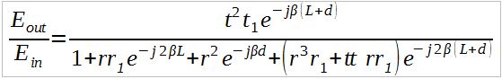
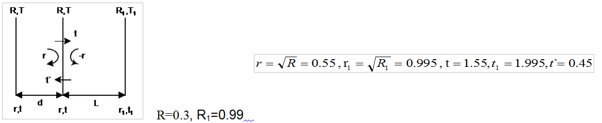
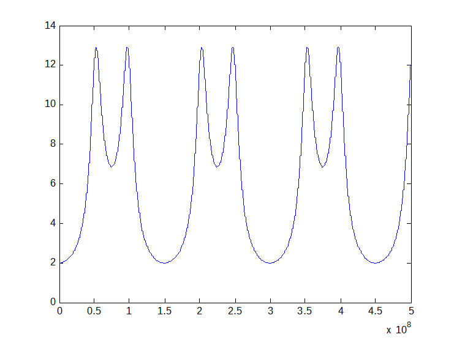

# MATLAB_scripts

--------------------------------
Opto_Prop7 contains matlab routine to draw the following Gain equation against frequency

which represent obtained Gain from the following opto-transmission 

Execution of this script should produces the following

-------------------------------