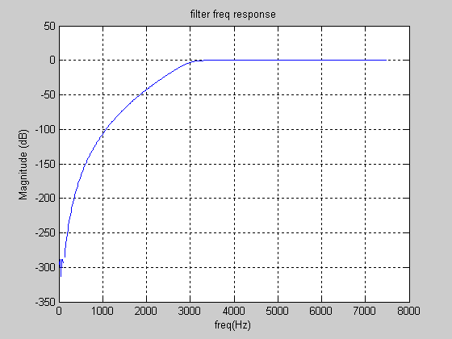

# MATLAB_scripts

--------------------------------

Opto_Prop7 contains matlab routine to draw the following Gain equation against frequency


Execution of this script should produce the following


-------------------------------

SignalProcessing_P9 contains various routines for creating figures in matlab/octave.

SignalProcessing_P11 contains routines for processed frequency components.


-------------------------------

Script to draw the following Butterworth HPF of order 10.
```
>> fsample=15000;
>> forder=10;
>> fcutoff=3000;
>> wn=fcutoff/(fsample/2);
>> [b,a]=butter(forder,wn,'high');
>> [h,w]=freqz(b,a,512);
>> w=w*fsample/2/pi;
>> plot(w,20*log10(abs(h)))
>> grid on
>> title('filter freq response')
>> xlabel('freq(Hz)')
>> ylabel('Magnitude (dB)')
```


-------------------------------

Script to draw the following Butterworth BPF.
```
>> forder=5;
>> fsample=15000;
>> wn=[3500 6500]/(fsample/2);
>> [b,a]=butter(forder,wn);
>> [h,w]=freqz(b,a,512);
>> w=w*fsample/2/pi;
>> plot(w,20*log10(abs(h)))
>> grid on
>> title('filter freq response');
>> xlabel('freq (Hz)');
>> ylabel('Mag (dB)'); 
```


-------------------------------

Script to draw superimposed signal.
```
>> t=(1:128)/10000;
>> yt=sin(pi*500*t)+3*cos(1000*pi*t)+10;
>> plot(t,yt)
>> grid on
>> title('Y(t)=sin(500*pi*t)+3cos(1000*pi*t)+10');
>> xlabel('Time (sec)')
>> ylabel('Amplitude')
```


-------------------------------

Script to have sub-plot.
```
>> SignalProcessing_Exp6
```

